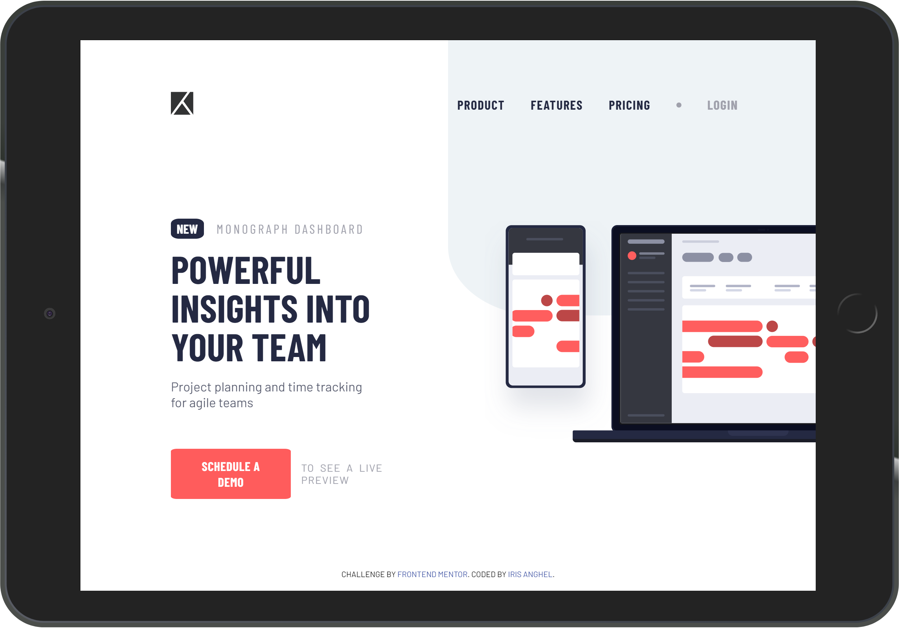
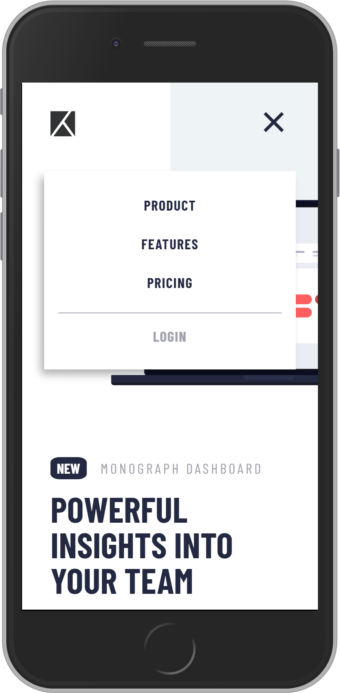

# Frontend Mentor - Project tracking intro component

[Frontend Mentor](https://www.frontendmentor.io) challenges allow you to improve your skills in a real-life workflow.

Your task is to build out the project to the designs inside the `/design` folder. You will find both a mobile and a desktop version of the design to work to. 

[Live Preview](https://iris-anghel.github.io/Frontendmentor-Project-tracking-intro-component/)

